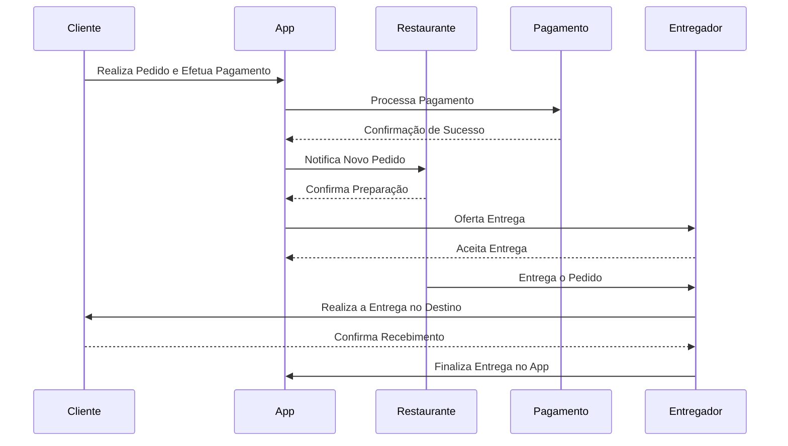

### **Diagrama de sequencia**

```mermaid
sequenceDiagram
    participant C as Cliente
    participant A as App
    participant R as Restaurante
    participant P as Pagamento
    participant E as Entregador

    
    C->>A: Realiza Pedido e Efetua Pagamento
    A->>P: Processa Pagamento 
    P-->>A: Confirmação de Sucesso
    A->>R: Notifica Novo Pedido
    R-->>A: Confirma Preparação
    A->>E: Oferta Entrega 
    E-->>A: Aceita Entrega
    R->>E: Entrega o Pedido 
    E->>C: Realiza a Entrega no Destino
    C-->>E: Confirma Recebimento 
    E->>A: Finaliza Entrega no App
```
 